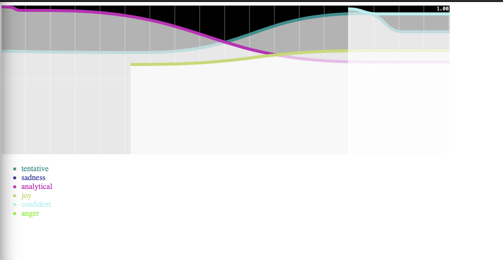

# Sentiment analysis of voice calls using IBM Watson

This is the companion code for the ["Add Sentiment Analysis to Your Inbound Call Flow with IBM Watson and Nexmo" webinar](https://youtu.be/nFIj8RVy8Pg). Note that the project has since been updated since the webinar has been recorded. The main differences are with the authentication with IBM Watson.

## Welcome to Vonage

If you're new to Vonage, you can [sign up for a Vonage API account](https://dashboard.nexmo.com/sign-up?utm_source=DEV_REL) and get some free credit to get you started.

## IBM Watson Credentials

This project uses 2 IBM Cloud services, the Speech to Text and Tone Analyzer. The credentials you need for Speech to Text are your service's location, e.g. "eu-gb", the service's instance id and your API Key.

For the Tone Analyzer you need your service's URL and API Key, which is different from the Speech to Text one. They can be fetched from the respective parts of the IBM Cloud dashboard.

## Running the project

First install the project dependencies using `pip install -r requirements.txt`.

Next set up your environment variables. Make an `.env` file using the command `cp .env-example .env`. Then fill out your `VONAGE_APPLICATION_ID`, `TEST_HANDSET`, `VONAGE_FROM_NUMBER` and the IBM Watson credentials. `TEST_HANDSET` is the number of a second phone that will be the moderator of the conference call. 

The project has three components:

+ The Vonage Application Server
+ The WebSocket Server
+ The Dashboard 

### The Vonage Application Server

Create a localtunnel for the Vonage Application Server port, 8000, using the following command. Replace `SUBDOMAIN` with a unique string 

`npx localtunnel --port 8000 --subdomain=SUBDOMAIN`

Add the domain to your `.env` file under `BASE_URL` and update your Vonage Application `answer_url` to the domain. Then you can run the server with `hug -f call_objects.py`.

### WebSocket Server

Create a localtunnel for the WebSocket Server port, 3000, using the following command. Replace `SUBDOMAIN` with the same unique string from the previous step 

`npx localtunnel --port 3000 --subdomain=SUBDOMAIN-sockets`

Add the domain to your `.env` file under `SOCKET_BASE_URL`. Then you can run the server with `python3 ws_server.py`.

### The Dashboard

Update `/dashboard/script.js` with the `SOCKET_BASE_URL` then open `index.html` in your web browser. With the dashboard open, you can now make a call to your `VONAGE_FROM_NUMBER` which will call the `TEST_HANDSET` number and open the WebSocket. When the test handset picks up, the call will begin and you will start to see the sentiment analysis on the chart.

## Getting Help

We love to hear from you so if you have questions, comments or find a bug in the project, let us know! You can either:

* Open an issue on this repository
* Tweet at us! We're [@VonageDev on Twitter](https://twitter.com/VonageDev)
* Or [join the Vonage Developer Community Slack](https://developer.nexmo.com/community/slack)

## Further Reading

* Check out the Developer Documentation at <https://developer.nexmo.com>
